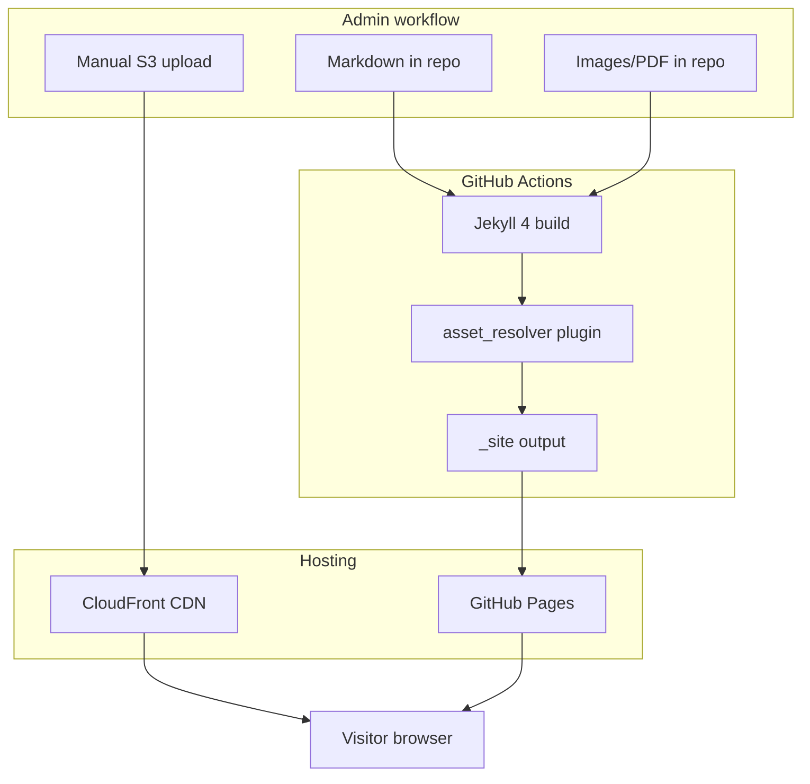

# feat: GMAHK Serpong Natura church website (Jekyll + GitHub Pages)

## Summary

Bootstrap a Jekyll 4 static site for GMAHK Serpong Natura with six Indonesian pages, Berita and Events collections, welcome-first Home layout, and per-file GitHub/S3 asset resolution. Deploy to GitHub Pages via GitHub Actions. Ship placeholder content and an admin guide so church admins can publish via Markdown on GitHub.

## Problem Frame

The church relies on social media only; newcomers lack a web destination for service times and location, and members lack a durable news archive. This plan implements the brainstormed static-site approach without a CMS, using Markdown in GitHub and optional S3/CloudFront for large media (see origin).

---

## Requirements

Requirements trace to the origin document. IDs preserved for downstream verification.

- R1. Six nav pages: Home, About, Service Times, Events, Berita, Contact.
- R2. Warm, welcoming, mobile-friendly design.
- R3. Static site on GitHub Pages; no server app in v1.
- R4. Welcome-first Home: hero, service times, Acara Mendatang, 1–2 latest Berita + “Lihat semua”.
- R5. Home does not duplicate full Berita or Events archives.
- R6. Berita archive, newest first.
- R7–R10. Berita posts: title, date, body; optional cover; PDF attachments; inline images.
- R11–R12. Events: dated items, Markdown-authored, distinct from Berita.
- R13–R15. About, Service Times, Contact (map embed, no form).
- R16–R20. Per-asset `storage: github | s3`; mixed storage per post supported.
- R21–R23. Admin workflow via GitHub; S3 upload manual in v1.
- R24–R25. Indonesian copy; placeholders acceptable in v1.

**Acceptance examples to preserve:** mixed-storage Berita post (AE1), Home Berita preview cap (AE2), Event vs Berita separation (AE3).

---

## Key Technical Decisions

- **GitHub Actions deploy (not legacy Pages gem build):** Custom `_plugins/` asset resolver is required; the Pages safelist blocks arbitrary plugins on the classic build. Actions use `jekyll/build`, `upload-pages-artifact`, and `deploy-pages` with Jekyll 4.x pinned in `Gemfile` (see origin R19; Jekyll CI docs).
- **Jekyll collections for `berita` and `events`:** Keeps admin workflow “add a `.md` file” without coupling to `_posts` categories. Events sorted by `event_date`; Berita by `date`.
- **Structured front matter for assets:** Cover image and PDF attachments use explicit objects with `storage`, `path` (github), or `url` (s3). Inline body images use standard Markdown: repo-relative paths for GitHub assets, full CloudFront URLs for S3 (admin guide documents this).
- **Events optional cover images:** Same cover object as Berita (resolves origin deferred question; low cost, consistent admin mental model).
- **Site-wide config in `_data/site.yml`:** Church name, service times snippet, contact fields, map embed URL, social links (placeholder URLs until church supplies real ones).
- **No automated S3 upload:** v1 resolves URLs at build time only; admin uploads to S3 manually (origin scope).
- **CSS: custom SCSS, no heavy theme gem:** Full control over warm palette and mobile nav without fighting a third-party theme.

---

## High-Level Technical Design



**Asset resolution (build time):**

| `storage` | Input in front matter | Resolved URL in HTML |
|-----------|----------------------|----------------------|
| `github` | `path: assets/images/foo.jpg` | `{{ site.baseurl }}/assets/images/foo.jpg` |
| `s3` | `url: https://dxxx.cloudfront.net/foo.jpg` | Use `url` as-is |

Attachments render as labeled download links on Berita post pages.

---

## Output Structure

```text
.github/workflows/
  jekyll.yml                 # build + deploy to GitHub Pages
  ci.yml                     # PR build + html-proofer (optional link check)
_config.yml
Gemfile
Gemfile.lock
_data/
  site.yml                   # church info, contact, social placeholders
  navigation.yml             # nav labels (ID) and paths
_plugins/
  asset_resolver.rb          # Liquid filters: resolve_asset, resolve_cover
_layouts/
  default.html
  page.html
  berita.html                # single Berita post
  event.html                 # single Event (optional)
_includes/
  head.html
  header.html
  footer.html
  hero.html
  service-times-snippet.html
  event-card.html
  berita-card.html
  cover-image.html
  attachments.html
assets/
  css/main.scss
  images/                    # placeholder hero, logo
  pdf/                       # sample github-hosted PDF
_berita/
  2026-07-04-selamat-datang.md
_events/
  2026-07-15-perkemahan-pemuda.md
index.html                   # Home
tentang-kami.md
jadwal-ibadah.md
acara.md                     # Events index
berita.md                    # Berita archive
kontak.md
docs/
  admin-guide.md             # how to publish Berita/Events + assets
spec/
  site_build_spec.rb
  asset_resolver_spec.rb
```

---

## Implementation Units

### U1. Jekyll scaffold and GitHub Pages deploy

**Goal:** Runnable Jekyll 4 project that builds locally and deploys to GitHub Pages on push to `main`.

**Requirements:** R3, success criteria (GitHub Pages deploy on push).

**Dependencies:** None.

**Files:**
- `Gemfile`
- `Gemfile.lock`
- `_config.yml`
- `.github/workflows/jekyll.yml`
- `.gitignore`
- `README.md` (update with local dev commands)

**Approach:**
- Pin `jekyll ~> 4.4`, `jekyll-sass-converter`, `jekyll-seo-tag`, `jekyll-sitemap` in Gemfile.
- `_config.yml`: `title`, `url` (placeholder `https://<org>.github.io/gmahk-serpong-natura-web`), `baseurl`, `lang: id`, collections `berita` and `events` with `output: true`, permalinks under `/berita/` and `/acara/`.
- Workflow: official Jekyll Pages pattern — `configure-pages`, `bundle exec jekyll build`, `upload-pages-artifact`, `deploy-pages`; `permissions: pages: write`, `id-token: write`.
- Set repository Pages source to **GitHub Actions** (document in README; not automatable from repo alone).

**Patterns to follow:** [Jekyll GitHub Actions docs](https://jekyllrb.com/docs/continuous-integration/github-actions/).

**Test scenarios:**
- Covers build success path.
- **Happy path:** `bundle exec jekyll build` exits 0 and creates `_site/index.html`.
- **Edge case:** Missing `_config.yml` collection entry causes build warning — verify collections are declared before content lands in U5/U6.

**Test expectation:** `spec/site_build_spec.rb` added in U9; U1 verified manually via workflow file review and local `bundle exec jekyll build`.

**Verification:** Push to `main` triggers deploy; Pages URL serves built site (smoke after U7).

---

### U2. Asset resolver plugin and front matter contract

**Goal:** Resolve `storage: github | s3` for cover images and PDF attachments at build time.

**Requirements:** R16–R20, AE1.

**Dependencies:** U1.

**Files:**
- `_plugins/asset_resolver.rb`
- `docs/admin-guide.md` (front matter section stub)
- `_includes/cover-image.html`
- `_includes/attachments.html`

**Approach:**
- Define front matter contract (documented in admin guide):

```yaml
cover:
  storage: github   # or s3
  path: assets/images/cover.jpg    # when github
  url: https://d123.cloudfront.net/path/file.jpg  # when s3
attachments:
  - label: Buletin Minggu Ini
    storage: github
    path: assets/pdf/buletin.pdf
  - label: Laporan
    storage: s3
    url: https://d123.cloudfront.net/reports/laporan.pdf
```

- Liquid filters `resolve_asset` and `resolve_cover` validate `storage` ∈ `{github, s3}`, require `path` or `url` accordingly, raise clear build error on invalid combo (fail fast for admin mistakes).
- `cover-image.html` renders `` with alt from post title.
- `attachments.html` renders list of `<a download>` links.

**Patterns to follow:** Jekyll `_plugins` convention; keep plugin pure Ruby, no network calls at build time.

**Test scenarios:**
- Covers AE1.
- **Happy path:** github cover + s3 attachment resolve to expected href/src strings.
- **Happy path:** s3 cover uses external URL unchanged.
- **Edge case:** `storage: github` without `path` fails build with readable message.
- **Edge case:** `storage: s3` without `url` fails build with readable message.
- **Edge case:** Unknown `storage` value fails build.

**Files (tests):** `spec/asset_resolver_spec.rb`

**Verification:** Unit tests pass; sample mixed-storage post in U8 renders correctly.

---

### U3. Base layout, warm theme, and mobile navigation

**Goal:** Shared chrome with warm palette, responsive hamburger nav for six pages.

**Requirements:** R1, R2, R24.

**Dependencies:** U1.

**Files:**
- `_layouts/default.html`
- `_layouts/page.html`
- `_includes/head.html`
- `_includes/header.html`
- `_includes/footer.html`
- `assets/css/main.scss`
- `_data/navigation.yml`
- `_data/site.yml` (skeleton)

**Approach:**
- Color direction: warm cream background (`#faf8f5`), earth-tone header (`#5c4a3a`), soft accent for cards; system font stack for fast load.
- Mobile-first CSS: stacked layout; nav collapses to hamburger under ~768px.
- `navigation.yml` lists six items with Indonesian labels matching origin.
- Footer: copyright, optional social icon links driven from `_data/site.yml` (`social.instagram`, `social.facebook` — empty href hides icon).
- `jekyll-seo-tag` in head for basic meta.

**Patterns to follow:** Welcome-first wireframe Option A from brainstorm (hero slot on Home only).

**Test scenarios:**
- **Happy path:** Built HTML includes all six nav links.
- **Happy path:** Viewport meta tag present for mobile.
- **Edge case:** Empty social URL omits corresponding footer link (no broken `href="#"`).

**Test expectation:** Covered by `spec/site_build_spec.rb` nav assertions in U9.

**Verification:** Visual smoke on mobile width; all nav routes return 200 after full build.

---

### U4. Static pages (About, Service Times, Contact)

**Goal:** Three content pages with placeholder Indonesian copy and contact map embed.

**Requirements:** R13–R15, R25.

**Dependencies:** U3.

**Files:**
- `tentang-kami.md`
- `jadwal-ibadah.md`
- `kontak.md`
- `_data/site.yml` (service times, address, phone, email, `map_embed_url`)
- `_includes/service-times-snippet.html` (reused on Home in U7)

**Approach:**
- `tentang-kami.md`: placeholder mission/history prose in Indonesian.
- `jadwal-ibadah.md`: Sabbath School + divine service times from `_data/site.yml`.
- `kontak.md`: address, phone, email, responsive Google Maps iframe from `site.data.site.map_embed_url` (placeholder coordinates for Serpong area until church supplies exact embed).
- No form elements.

**Patterns to follow:** Origin contact display-only decision.

**Test scenarios:**
- **Happy path:** Contact page HTML contains address and map iframe `src`.
- **Happy path:** Service times page lists times from data file.

**Verification:** Pages build and link from nav.

---

### U5. Events collection and Acara page

**Goal:** Dated events as Markdown collection; listing on `/acara/` and optional detail pages.

**Requirements:** R11–R12, AE3.

**Dependencies:** U2, U3.

**Files:**
- `_events/2026-07-15-perkemahan-pemuda.md` (sample)
- `acara.md`
- `_layouts/event.html` (if per-event pages enabled)
- `_includes/event-card.html`

**Approach:**
- Front matter: `title`, `event_date`, `description`, optional `cover` (same schema as Berita).
- `acara.md` loops `site.events | sort: 'event_date'`, filters future-or-recent per product choice: show upcoming + last 30 days past (document in admin guide).
- Event cards show date, title, excerpt; link to detail page when `output: true` on collection.
- Distinct URL namespace `/acara/` vs `/berita/`.

**Patterns to follow:** Origin Events vs Berita separation.

**Test scenarios:**
- Covers AE3 (event not on Berita index).
- **Happy path:** Sample youth camp appears on `acara.html`.
- **Happy path:** Event with github cover renders image via resolver.
- **Edge case:** Event without cover still renders card without broken image.

**Verification:** AE3 manual check with sample Berita + Event content in U8.

---

### U6. Berita collection, archive, and post layout

**Goal:** Blog-style Berita with archive page and post template supporting cover + PDF attachments.

**Requirements:** R6–R10, R16–R20, AE1, AE2 (partial — Home cap in U7).

**Dependencies:** U2, U3.

**Files:**
- `_berita/2026-07-04-selamat-datang.md` (sample)
- `_berita/2026-07-01-pengumuman-ibadah.md` (sample, mixed storage for AE1)
- `berita.md`
- `_layouts/berita.html`
- `_includes/berita-card.html`

**Approach:**
- Collection `berita` sorted by `date` descending on archive page.
- Post layout: title, formatted date (Indonesian locale via `date` filter + copy), cover, rendered Markdown body, attachments block.
- Inline images: standard Markdown; admin guide explains github relative vs s3 absolute URLs.
- Archive shows cards with title, date, excerpt (`excerpt` or truncated body).

**Test scenarios:**
- Covers AE1.
- **Happy path:** Archive lists posts newest first.
- **Happy path:** Post with PDF attachment renders download link with correct href for github and s3.
- **Edge case:** Post without cover skips cover block without layout break.

**Files (tests):** extend `spec/site_build_spec.rb` for berita paths.

**Verification:** AE1 satisfied by sample mixed-storage post.

---

### U7. Home page (welcome-first layout)

**Goal:** Assemble hero, service times, upcoming events, and Berita preview per Option A layout.

**Requirements:** R4, R5, AE2.

**Dependencies:** U4, U5, U6.

**Files:**
- `index.html`
- `_includes/hero.html`

**Approach:**
- Hero: placeholder church image from `assets/images/hero-placeholder.jpg`, headline “Selamat datang di GMAHK Serpong Natura”, subtext in Indonesian.
- Service times: include `service-times-snippet.html` immediately below hero.
- Acara Mendatang: up to 3 upcoming events via `event-card.html`.
- Berita preview: `site.berita | sort: 'date' | reverse | limit:2`, then link “Lihat semua →” to `/berita/`.
- Does not list full archives.

**Test scenarios:**
- Covers AE2.
- **Happy path:** With 5 sample Berita posts, Home HTML contains exactly 2 berita card titles (string count or structured test).
- **Happy path:** “Lihat semua” href points to `/berita/`.
- **Edge case:** Zero Berita posts — section shows friendly empty state in Indonesian, no broken includes.

**Verification:** AE2 automated in `spec/site_build_spec.rb`.

---

### U8. Placeholder assets and admin guide

**Goal:** Enable admin self-service and realistic placeholder content for v1 launch.

**Requirements:** R21–R23, R25, F1–F2.

**Dependencies:** U2–U7.

**Files:**
- `assets/images/hero-placeholder.jpg`, `assets/images/logo-placeholder.png`
- `assets/pdf/sample-buletin.pdf` (minimal PDF)
- `docs/admin-guide.md` (complete)
- Additional sample `_berita/` and `_events/` files as needed for AE2/AE3

**Approach:**
- Admin guide sections: repo structure, creating Berita/Event files, front matter reference, github vs s3 decision guide, pushing via GitHub UI, expected deploy delay, S3 manual upload steps (console → copy CloudFront URL).
- Link admin guide from `README.md`.
- Placeholder copy clearly marked “Ganti dengan konten asli” in comments or prose where helpful.

**Patterns to follow:** Origin actor A3 (GitHub-comfortable admin).

**Test scenarios:**
- **Happy path:** README links to `docs/admin-guide.md`.
- **Happy path:** Sample github PDF attachment returns 200 in built `_site`.

**Test expectation:** none for guide prose — content review only.

**Verification:** Non-developer can follow guide to add a post (manual acceptance).

---

### U9. CI verification tests

**Goal:** Automated guardrails on PR and main: build succeeds, key pages exist, asset resolver unit tests pass.

**Requirements:** R3, success criteria (mobile/build reliability).

**Dependencies:** U1–U8.

**Files:**
- `.github/workflows/ci.yml`
- `spec/site_build_spec.rb`
- `spec/spec_helper.rb`
- `Gemfile` (add `rspec` to `:test` group)

**Approach:**
- `ci.yml` on pull_request: `bundle install`, `bundle exec rspec`, `bundle exec jekyll build`, optional `htmlproofer` on `_site` with external link check disabled (S3 URLs may 403 in CI) or `disable_external` true.
- `site_build_spec.rb`: after build, assert files exist: `index.html`, `berita/index.html`, `acara/index.html`, `kontak/index.html`; assert Home contains nav labels; assert AE2 two-post cap if sample data present.
- `asset_resolver_spec.rb`: unit tests from U2.

**Patterns to follow:** Standard Ruby/RSpec layout.

**Test scenarios:**
- **Happy path:** CI passes on clean tree.
- **Integration:** Invalid front matter in fixture post causes build failure (optional negative fixture in spec tmp dir).

**Verification:** Green CI on PR; documents `bundle exec rspec` in README.

---

## Scope Boundaries

**In scope for this plan:** Full v1 site per origin requirements; GitHub Actions deploy; admin guide; placeholder content.

**Deferred for later (from origin — not in this plan):**
- Contact form, WhatsApp button, bilingual content, Berita categories/tags, social auto-sync, automated S3 upload, member login, sermon media, dedicated Downloads page.

**Deferred to Follow-Up Work (plan-local sequencing):**
- Custom domain + DNS documentation (after initial `github.io` launch).
- `htmlproofer` external URL validation against live CloudFront (enable once bucket is public).

**Outside this product's identity:** ChMS, live streaming, native app (per origin).

---

## System-Wide Impact

- **Visitors (A1, A2):** Public static site; no auth.
- **Admin (A3):** GitHub repo write access; optional AWS console for S3 uploads.
- **Operations:** GitHub Actions minutes for build/deploy; GitHub Pages hosting; S3/CloudFront costs for large media only.

---

## Risks and Dependencies

| Risk | Mitigation |
|------|------------|
| GitHub Pages not set to Actions source | README setup checklist; verify first deploy manually |
| Admin misconfigures front matter | Plugin fails build with explicit error; document in admin guide |
| S3 CORS not needed for static links | PDFs/images are direct links, not XHR — CORS unlikely; note in admin guide if hotlinking issues arise |
| Large repo binaries | Steer large files to S3 via admin guide |
| Map embed placeholder wrong location | Replace `map_embed_url` in `_data/site.yml` before public launch |

**Prerequisites:** GitHub repo; Pages enabled; AWS S3 + CloudFront optional until first S3 asset used.

---

## Open Questions

**Deferred to implementation:**
- Exact CloudFront distribution URL pattern for church bucket.
- Final Instagram/Facebook URLs for footer (use placeholders in `_data/site.yml` until supplied).
- Custom domain hostname and DNS provider.

**Resolved in this plan:**
- Front matter field names → `cover`, `attachments`, `storage`, `path`, `url`.
- Events optional images → yes, same cover schema.
- Footer social links → yes, data-driven placeholders.

---

## Sources and Research

- Origin: `docs/brainstorms/2026-07-04-gmahk-serpong-natura-website-requirements.md`
- Jekyll GitHub Actions: https://jekyllrb.com/docs/continuous-integration/github-actions/
- GitHub Pages gem safelist limitations → motivated Actions + custom plugin (external research load-bearing for KTD #1)
