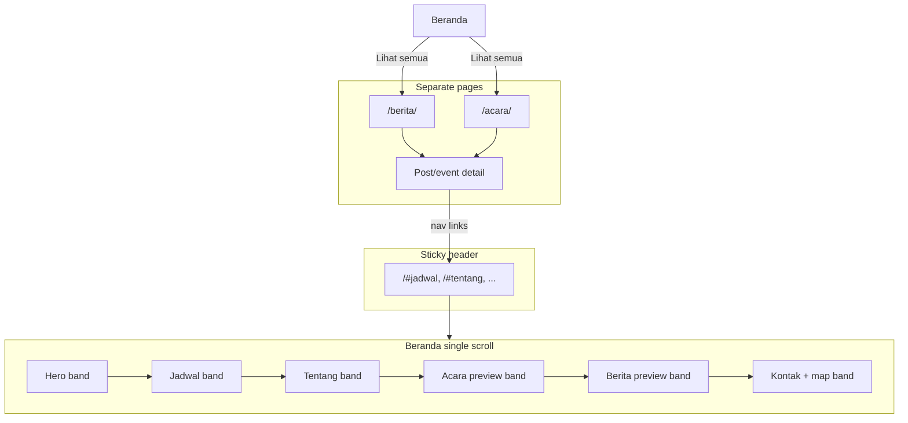

# feat: V2 single-page scroll layout (gmahkbsd-inspired)

## Summary

Restructure GMAHK Serpong Natura into a free-flowing, full-bleed single-scroll Beranda inspired by [gmahkbsd.org](https://gmahkbsd.org/), with YAML-toggle section registry for future expansion. Tentang, Jadwal, and Kontak merge into Beranda anchors; Berita and Acara keep archive and detail pages with matching v2 styling. All implementation happens in an isolated git worktree on branch `version2` so `main` stays v1 until merge.

## Problem Frame

v1 uses a constrained 1100px multi-page layout. The church wants a warmer, continuous top-to-bottom flow like the sister church site BSD. v1 content model (Jekyll collections, GitHub/S3 assets, Markdown admin workflow) stays; only information architecture and presentation change.

---

## Requirements

Requirements trace to the 2026-07-08 brainstorm dialogue. v1 origin capabilities (collections, asset resolver, Indonesian copy) remain unless overridden below.

**Layout and Beranda**

- R1. Beranda is one continuous scroll in this order: Hero → Jadwal → Tentang → Acara preview → Berita preview → Kontak + peta.
- R2. Sections use full-bleed alternating background bands; content is centered inside each band.
- R3. Sticky header navigation scrolls smoothly to in-page anchors (`#jadwal`, `#tentang`, `#acara`, `#berita`, `#kontak`).
- R4. Section visibility and order are driven by `_data/home.yml` so admins can enable future sections (e.g. Pengurus) without editing Liquid templates.
- R5. Core sections only in v2 — no Pengurus or Majelis photo grids.

**Navigation and pages**

- R6. Remove standalone `tentang-kami`, `jadwal-ibadah`, and `kontak` pages as primary destinations; their content lives on Beranda.
- R7. Old URLs for removed pages redirect to the matching Beranda anchor (meta-refresh redirect layout; GitHub Pages–compatible, no server config).
- R8. On Berita/Acara archive and detail pages, nav links point to Beranda anchors (e.g. `/#berita`), not removed pages.
- R9. Berita and Acara archive pages (`berita.md`, `acara.md`) and collection detail layouts use the same full-bleed visual language as Beranda.

**Preserved from v1**

- R10. Berita and Events collections, asset resolver plugin, and per-file GitHub/S3 storage unchanged.
- R11. Kontak is display-only — address, phone, email, map embed; no contact form.
- R12. Home shows at most two Berita previews and Acara preview with “Lihat semua” links to archives (AE2 behavior preserved).
- R13. Indonesian visitor-facing copy; placeholders acceptable.

**Delivery**

- R14. Work is isolated on branch `version2` in git worktree `.worktrees/version2/`; `main` is not modified until an explicit merge.

---

## Key Technical Decisions

- **Git worktree isolation:** Branch `version2` from `main` at `.worktrees/version2/`. Add `.worktrees/` to `.gitignore` before creating the worktree. All v2 commits land on `version2` (see `ce-worktree` skill).
- **YAML section registry:** `_data/home.yml` holds an ordered list of section entries (`id`, `enabled`, optional `label`). `index.html` loops enabled sections and includes matching partials from `_includes/home/`. Disabled sections (e.g. `pengurus`) ship as stubs or empty toggles for later.
- **Anchor navigation in `_data/navigation.yml`:** Nav items for merged pages use hash URLs relative to Beranda (`/#tentang`, `/#jadwal`, etc.). Acara and Berita nav items scroll to home preview sections; full archives remain at `/acara/` and `/berita/`.
- **Full-bleed CSS pattern:** New `.section-band` (full viewport width background) + `.section-inner` (max-width content, reusing ~1100px token). Alternate band modifier classes (e.g. `.section-band--accent`, `.section-band--muted`) replace the old `.site-main` max-width wrapper on Beranda.
- **Beranda layout exception:** `default.html` keeps header/footer; Beranda uses a `layout: home` (or `main` without max-width constraint) so bands can span edge-to-edge while header/footer stay consistent.
- **Redirects without plugins:** A minimal `_layouts/redirect.html` with `<meta http-equiv="refresh">` and canonical link for `/tentang-kami/`, `/jadwal-ibadah/`, `/kontak/` — avoids `jekyll-redirect-from`, which is not in the Pages safelist.
- **Smooth scroll:** `scroll-behavior: smooth` on `html` plus `nav.js` closes mobile menu after anchor click and sets `aria-expanded` correctly.
- **No new CSS framework:** Extend `assets/css/main.scss` only; preserve warm palette tokens.

---

## High-Level Technical Design



**Section registry (conceptual):**

```yaml
# _data/home.yml
sections:
  - id: hero
    enabled: true
  - id: jadwal
    enabled: true
  - id: tentang
    enabled: true
  - id: acara
    enabled: true
  - id: berita
    enabled: true
  - id: kontak
    enabled: true
  - id: pengurus
    enabled: false   # flip when content ready
```

`index.html` iterates `site.data.home.sections`, skips `enabled: false`, renders `` inside a `.section-band` with `id="<id>"`.

---

## Scope Boundaries

**In scope**

- Beranda restructure, anchor nav, full-bleed styling on Beranda + archives + detail layouts, redirect stubs, test/doc updates.

**Deferred for later**

- Pengurus Gereja and Majelis Jemaat grids (toggle exists; content and include ship when ready).
- Contact form or WhatsApp button.
- Scroll-spy active nav highlighting (optional polish; not required for v2 ship).
- Custom domain or deploy pipeline changes.

**Deferred to Follow-Up Work**

- Merging `version2` into `main` and removing the worktree (post-review user action).
- Writing a formal `docs/brainstorms/2026-07-08-v2-layout-requirements.md` artifact if the team wants a durable brainstorm doc separate from this plan.

**Outside scope**

- Changes to asset resolver, S3 workflow, or collection schemas.
- English/bilingual content.

---

## Implementation Units

### U1. Worktree and branch setup

**Goal:** Isolate v2 work without touching the `main` checkout.

**Requirements:** R14

**Dependencies:** None

**Files:**
- `.gitignore` (add `.worktrees/`)

**Approach:** From repo root on `main`: ensure `.worktrees/` is gitignored, run `git fetch origin main` (non-fatal if no remote), then `git worktree add -b version2 .worktrees/version2 main`. All subsequent units execute inside `.worktrees/version2/`.

**Test expectation:** none — scaffolding only

**Verification:** `git worktree list` shows `.worktrees/version2` on branch `version2`; root checkout remains on `main`.

---

### U2. Section registry and home layout shell

**Goal:** Data-driven section ordering with a Beranda layout that allows full-bleed bands.

**Requirements:** R1, R4, R5

**Dependencies:** U1

**Files:**
- `_data/home.yml` (create)
- `_data/about.yml` (create — visi/misi/sejarah content moved from `tentang-kami.md`)
- `_layouts/home.html` (create)
- `index.html` (modify — use `layout: home`, section loop)

**Approach:** Create `_layouts/home.html` extending `default` with `<main>` unconstrained by max-width. Loop `site.data.home.sections`; for each enabled entry, wrap `` in `<section class="section-band" id="{{ id }}">`. Seed `about.yml` from existing `tentang-kami.md` prose.

**Patterns to follow:** Existing `index.html` Liquid for event/berita filtering; `_data/site.yml` structure.

**Test scenarios:**
- Home build includes all six enabled section `id` attributes in order.
- Setting `pengurus.enabled: false` omits pengurus markup from output.

**Verification:** `bundle exec jekyll build` succeeds; `_site/index.html` contains `id="jadwal"` through `id="kontak"` in order.

---

### U3. Full-bleed CSS system

**Goal:** Edge-to-edge section bands with centered content and alternating backgrounds.

**Requirements:** R2, R9

**Dependencies:** U2

**Files:**
- `assets/css/main.scss` (modify)

**Approach:** Add `.section-band` (full width, padding), `.section-inner` (max-width centered), modifier classes for alternating backgrounds using existing `$color-bg`, `$color-accent`, `$color-accent-green`. Remove max-width from Beranda-specific main wrapper; keep `.site-main` max-width for archive/detail pages or scope via layout class on `body`. Add `html { scroll-behavior: smooth; scroll-padding-top: <header-height>; }` for sticky header offset.

**Patterns to follow:** Existing color tokens and `.section-block`, `.card-grid` styles.

**Test expectation:** none — styling; verified via build + visual check

**Verification:** Built HTML uses band classes; archive pages retain readable layout on mobile (manual or browser check in ce-work).

---

### U4. Home section includes

**Goal:** Extract each Beranda block into reusable includes with correct content.

**Requirements:** R1, R5, R11, R12

**Dependencies:** U2, U3

**Files:**
- `_includes/home/hero.html` (create — from `_includes/hero.html`, CTA targets `#kontak`)
- `_includes/home/jadwal.html` (create — from `service-times-snippet.html`, drop “lihat jadwal lengkap” link to removed page)
- `_includes/home/tentang.html` (create — from `_data/about.yml`)
- `_includes/home/acara.html` (create — from current `index.html` Acara block)
- `_includes/home/berita.html` (create — from current `index.html` Berita block)
- `_includes/home/kontak.html` (create — from `kontak.md` fields + map embed)
- `_includes/hero.html` (deprecate or keep for reference — remove usage from index)

**Approach:** Each include renders inside the band wrapper from the loop (include only inner content). Kontak section reuses `site.data.site.contact`. Preserve AE2 cap (2 berita cards, 3 events). Hero button links to `#kontak` instead of `/kontak/`.

**Test scenarios:**
- Covers AE2. Home output contains exactly two `berita-card` occurrences and “Lihat semua”.
- Kontak section includes `<iframe` and contact fields; no `<form>`.

**Verification:** `bundle exec jekyll build`; spot-check `_site/index.html` section content.

---

### U5. Anchor navigation and mobile nav behavior

**Goal:** Sticky header links scroll to Beranda sections; works from archive/detail pages too.

**Requirements:** R3, R8

**Dependencies:** U2

**Files:**
- `_data/navigation.yml` (modify)
- `_includes/header.html` (modify — hash-aware active state on home)
- `assets/js/nav.js` (modify)

**Approach:** Update navigation entries:

| Label | Path |
|-------|------|
| Beranda | `/` |
| Tentang Kami | `/#tentang` |
| Jadwal Ibadah | `/#jadwal` |
| Acara | `/#acara` |
| Berita | `/#berita` |
| Kontak | `/#kontak` |

Use `relative_url` with hash paths. On non-home pages, same paths resolve to Beranda anchors. In `nav.js`, on anchor link click close `.site-nav.is-open` and reset toggle `aria-expanded`. Active state on home: `page.url == '/'` and optional hash match (minimal: mark Beranda active on `/` only).

**Test scenarios:**
- Home HTML nav contains `href` values ending with `#jadwal`, `#tentang`, `#kontak`.
- Berita archive page nav links point to `/#berita` (or baseurl-prefixed equivalent), not `/berita/` for the nav label “Berita” when that item is the anchor (archive reached via “Lihat semua”).

**Verification:** Build and inspect `_site/index.html` and `_site/berita/index.html` nav `href` attributes.

---

### U6. Remove standalone pages and add redirects

**Goal:** Eliminate duplicate destinations; preserve old URLs.

**Requirements:** R6, R7

**Dependencies:** U4

**Files:**
- `tentang-kami.md` (replace with redirect front matter)
- `jadwal-ibadah.md` (replace with redirect front matter)
- `kontak.md` (replace with redirect front matter)
- `_layouts/redirect.html` (create)

**Approach:** Redirect layout sets `redirect_to: /#tentang` (with baseurl) via meta refresh + visible “Mengalihkan…” link for accessibility. Each stub page keeps its permalink. Remove prose duplication — canonical content only in home includes / `_data/about.yml`.

**Test scenarios:**
- Built `_site/tentang-kami/index.html` contains meta refresh or link targeting Beranda tentang anchor.
- `_site/kontak/index.html` no longer serves as primary contact page (redirect only).

**Verification:** `bundle exec jekyll build`; confirm redirect HTML exists at old paths.

---

### U7. Archive and detail page styling

**Goal:** Berita and Acara pages match v2 full-bleed visual language.

**Requirements:** R9, R10

**Dependencies:** U3

**Files:**
- `_layouts/page.html` (modify — optional band wrapper for page header)
- `_layouts/berita.html` (modify)
- `_layouts/event.html` (modify)
- `berita.md` (modify — band structure if needed)
- `acara.md` (modify)

**Approach:** Wrap archive content in `.section-band` / `.section-inner`. Detail layouts get consistent header band and prose area. Do not change collection permalinks or asset rendering.

**Test scenarios:**
- Covers AE1. Mixed-storage berita post still renders CloudFront cover and GitHub PDF.
- Covers AE3. Events absent from berita archive; present on acara archive.

**Verification:** Existing AE1/AE3 specs pass after updates.

---

### U8. Tests, docs, and admin guide

**Goal:** CI reflects new IA; admins understand section toggles.

**Requirements:** R4, R12, R13

**Dependencies:** U4, U5, U6, U7

**Files:**
- `spec/site_build_spec.rb` (modify)
- `docs/admin-guide.md` (modify)
- `README.md` (modify)

**Approach:** Update `site_build_spec.rb`:
- Replace “builds key pages” to expect redirect stubs instead of full `tentang-kami`/`kontak` content pages.
- Add example asserting home section order via `id` attribute sequence.
- Keep AE1/AE2/AE3 tests; update AE2 selector if class names change.
- Document `_data/home.yml` toggle pattern and anchor nav in admin guide.

**Test scenarios:**
- Home section ids appear in brainstorm order.
- Nav labels present on home.
- Contact map on home (not only on removed kontak page) — add spec reading `_site/index.html` for iframe.

**Verification:** `bundle exec rspec` and `bundle exec jekyll build` green in worktree.

---

## System-Wide Impact

- **Visitors:** Single-scroll Beranda; bookmarked `/tentang-kami/` etc. redirect to anchors.
- **Admins:** Edit `_data/about.yml` and `_data/site.yml` for Tentang/Kontak; enable future sections via `_data/home.yml`.
- **CI/GitHub Pages:** No workflow changes; same Jekyll build. Deploy from `version2` only when ready (optional preview branch).
- **v1 on main:** Unaffected until merge.

---

## Risks and Mitigation

| Risk | Mitigation |
|------|------------|
| Sticky header covers anchor targets | `scroll-padding-top` on `html` |
| Hash links break with `baseurl` | Use `relative_url` filter consistently; test under configured baseurl |
| Meta-refresh redirects SEO/clunky | Acceptable for small church site; add visible fallback link |
| Worktree drift from main | Rebase `version2` on `main` before merge if main moves |

---

## Open Questions

**Deferred to implementation**

- Exact alternating band color sequence (implementer picks from existing tokens; no new brand colors).
- Whether to add scroll-spy active nav (optional; defer unless quick).

**Resolve before merge to main**

- Confirm site is public: if yes, verify redirects on production URLs after deploy.

---

## Sources and Research

- Reference site: [gmahkbsd.org](https://gmahkbsd.org/) — single-scroll section stack.
- v1 plan: `docs/plans/2026-07-04-001-feat-gmahk-church-website-plan.md`
- v1 requirements: `docs/brainstorms/2026-07-04-gmahk-serpong-natura-website-requirements.md`
- Current layout constraints: `assets/css/main.scss` (`$max-width: 1100px`), `index.html` section stack.
- External research: not required — layout refactor with strong local Jekyll patterns.
