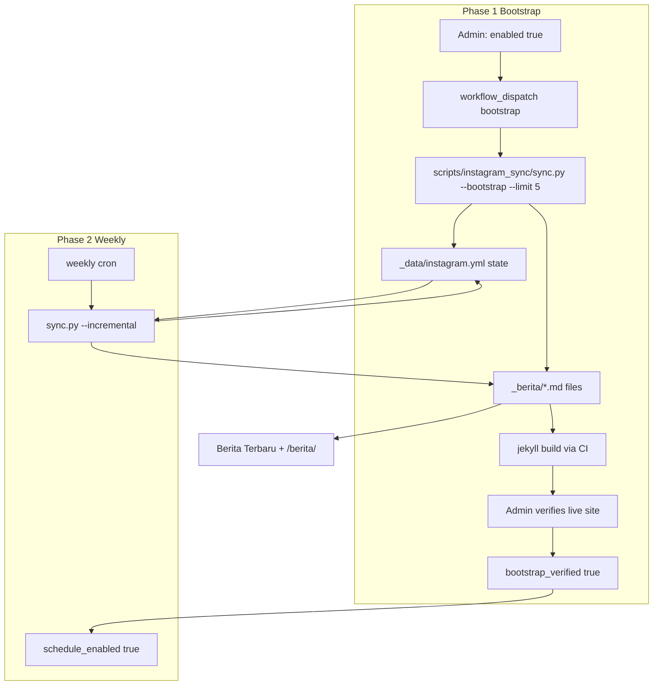

# Instagram Berita Sync - Plan

## Goal Capsule

- **Objective:** Automatically surface posts from [@gmahk_serpong_natura](https://www.instagram.com/gmahk_serpong_natura/) in Berita Terbaru and the Berita archive alongside manual articles, with a feature flag to enable or disable the pipeline.
- **Product authority:** Product Contract in this document (from `ce-brainstorm`).
- **Rollout:** Phase 1 — bootstrap import of the five most recent posts and admin verification on the built site. Phase 2 — enable weekly scheduled sync for new posts only after verification.
- **Open blockers:** None.

**Product Contract preservation:** Unchanged except Outstanding Questions resolved in Planning Contract KTDs below.

---

## Product Contract

### Summary

Roll out in two phases: first a one-time import of the **five most recent** existing Instagram posts, verified on the live site; then enable a feature-flagged weekly sync for new posts only. Both phases write berita entries with caption as Markdown, hotlinked Instagram image URLs, unified date-sorted listings, and a subtle **Dari Instagram** badge.

### Problem Frame

Berita today is entirely manual: admins create Markdown files in `_berita/` and commit to GitHub. The church also publishes on Instagram, which creates duplicate effort and leaves the website without those updates unless someone re-types them. Social auto-sync was explicitly deferred in the original website plan; this feature picks up that deferred work with a bounded v1 scope.

### Key Decisions

- **Bootstrap before scheduler** — import the five most recent existing posts first; enable the weekly cron only after those entries display correctly on the built site.
- **Weekly scheduled sync over real-time** — after bootstrap, a GitHub Actions cron job runs once per week; no push-on-post latency requirement.
- **Hotlinked images over local storage** — generated berita reference Instagram-hosted image URLs instead of downloading to `assets/images/`. Lighter repo footprint; images may break if Instagram changes or expires URLs.
- **Unofficial fetch over Meta Graph API** — avoid Business/Creator account and Meta developer app setup. Trade reliability for simpler admin onboarding.
- **Unified feed over separate section** — Instagram and manual berita interleave by date in Berita Terbaru and `/berita/`; visitors distinguish sources via a subtle badge, not a separate block.
- **Incremental after bootstrap** — weekly runs ingest posts published after the last successful sync; the bootstrap import is a separate one-time step capped at five posts.
- **Feature flag defaults off** — sync and display are disabled until an admin explicitly enables them.

### Actors

- A1. **Visitor** — reads Berita Terbaru on Beranda and the full Berita archive; may not notice source unless looking for the badge.
- A2. **Admin** — toggles the feature flag, runs bootstrap, sets `bootstrap_verified`, and monitors sync health.
- A3. **Sync job** — one-time bootstrap import and, after go-live, weekly automated fetch of new Instagram posts; deduplicates against prior runs and writes berita entries.

### Key Flows

- F0. **Bootstrap import (phase 1)**
  - **Trigger:** Admin runs `workflow_dispatch` bootstrap job while `enabled: true`.
  - **Actors:** A2, A3
  - **Steps:** Fetch the five most recent posts from @gmahk_serpong_natura → create berita entries with caption, hotlinked cover, `source: instagram`, and post dates → seed sync state with those five post IDs → commit → build and deploy → admin confirms display → set `bootstrap_verified: true`.
  - **Outcome:** Up to five historical Instagram posts appear in Berita; `schedule_enabled` remains `false`.
  - **Covered by:** R1, R4, R5, R6, R7, R13, R14

- F1. **Weekly sync (phase 2, happy path)**
  - **Trigger:** Cron schedule fires; `enabled: true`, `bootstrap_verified: true`, and `schedule_enabled: true`.
  - **Actors:** A3
  - **Steps:** Read last-sync state → fetch posts newer than last sync → skip posts already recorded → create berita entries → update sync state → commit.
  - **Outcome:** New berita files exist; next site build includes them in the unified feed.
  - **Covered by:** R1, R2, R3, R4, R5, R6, R7, R14

- F2. **Visitor reads mixed Berita Terbaru**
  - **Trigger:** Visitor opens Beranda or `/berita/`.
  - **Actors:** A1
  - **Steps:** Site renders visible berita sorted by date descending → Berita Terbaru shows the two newest overall → Instagram-sourced cards and post pages show **Dari Instagram** badge.
  - **Outcome:** Visitor sees a single coherent news feed with optional source indication.
  - **Covered by:** R8, R9, R10

- F3. **Feature flag off**
  - **Trigger:** Admin sets `enabled: false`.
  - **Actors:** A2, A3
  - **Steps:** Sync workflows no-op → Liquid templates exclude `source: instagram` posts from listings.
  - **Outcome:** Site behaves as today for visitors; generated files remain in the repo.
  - **Covered by:** R1, R11

### Requirements

**Sync and data**

- R1. A feature flag controls whether Instagram sync runs and whether Instagram-sourced berita appear on the site; default is disabled.
- R2. A scheduled job runs weekly when the flag is enabled and scheduling is enabled.
- R3. Each run ingests all Instagram posts published after the last successful sync, not only the most recent post.
- R4. Each ingested post becomes a berita entry with the Instagram caption as the Markdown body.
- R5. Each ingested post stores a hotlinked Instagram image URL for display; images are not committed to `assets/images/`.
- R6. Each ingested post carries metadata identifying it as Instagram-sourced and records the original Instagram post identifier for deduplication.
- R7. Persisted sync state records the last successful sync time and already-synced post identifiers so reruns do not duplicate entries.
- R13. A one-time bootstrap import ingests the five most recent Instagram posts before any scheduled sync is enabled.
- R14. The weekly scheduler does not run until bootstrap entries are verified as correctly displayed on the built site.

**Display**

- R8. Instagram-sourced berita appear in the same date-sorted listings as manual berita on Beranda (Berita Terbaru) and `/berita/`.
- R9. Berita Terbaru continues to show the two newest berita overall after merge, including Instagram-sourced posts when they rank in the top two by date.
- R10. Instagram-sourced berita display a subtle **Dari Instagram** badge on list cards and on the post detail page.

**Admin and safety**

- R11. When the feature flag is disabled, visitors see no Instagram-sourced berita in listings and no new sync writes occur.
- R12. Manual berita workflow is unchanged; admins can still add, edit, and remove hand-authored posts independently of sync.

### Acceptance Examples

- AE0. **Bootstrap import**
  - **Covers:** R4, R5, R6, R7, R13, R14
  - **Given:** Profile has at least five public posts; scheduler not yet enabled.
  - **When:** Admin runs bootstrap import and deploys the site.
  - **Then:** Up to five berita entries exist with captions, hotlinked covers, and Instagram metadata; sync state lists all imported post IDs; weekly scheduler remains off.

- AE1. **First weekly sync after bootstrap**
  - **Covers:** R2, R3, R4, R5, R6, R7, R14
  - **Given:** Bootstrap verified; five posts already imported; two new posts published on Instagram since bootstrap.
  - **When:** Weekly job runs.
  - **Then:** Exactly two new berita entries are created; the five bootstrap posts are not duplicated.

- AE2. **Incremental sync**
  - **Covers:** R3, R7
  - **Given:** Last sync recorded two posts; one new post published on Instagram since then.
  - **When:** Weekly job runs.
  - **Then:** Exactly one new berita entry is created; prior two are not duplicated.

- AE3. **Mixed Berita Terbaru**
  - **Covers:** R8, R9, R10
  - **Given:** Manual berita dated yesterday; Instagram berita dated today and two days ago.
  - **When:** Visitor opens Beranda.
  - **Then:** Berita Terbaru shows today's Instagram post and yesterday's manual post; today's card shows **Dari Instagram**.

- AE4. **Flag disabled**
  - **Covers:** R1, R11
  - **Given:** Instagram-sourced berita exist from a prior enabled period; flag now disabled.
  - **When:** Visitor opens Beranda and `/berita/`.
  - **Then:** Instagram-sourced entries are not shown; manual berita still appear.

### Success Criteria

- The five most recent Instagram posts display correctly on Berita before the weekly scheduler is turned on.
- After scheduler enablement, a new Instagram post published during the week appears on the website within one weekly sync cycle without admin retyping the caption.
- Visitors experience one Berita feed; manual pengumuman and Instagram posts are distinguishable only by the badge.
- Disabling the flag restores pre-feature visitor behavior without breaking manual berita.

### Scope Boundaries

**In scope**

- One-time bootstrap import of the five most recent posts for @gmahk_serpong_natura.
- Weekly Instagram-to-berita sync for new posts, enabled only after bootstrap verification.
- Feature flag, deduplication, unified feed merge, and **Dari Instagram** badge.
- Hotlinked image URLs with a new `external` cover storage mode.

**Deferred for later**

- Meta Graph API as a more reliable fetch backend if the unofficial approach breaks.
- Downloading and storing images locally for long-term archive resilience.
- Instagram Stories, Reels-only posts, carousels beyond the first image, and video-native post types.
- Real-time or sub-weekly sync cadence.
- Bilingual captions or automatic translation.

**Outside scope**

- Sync from Facebook or other social networks.
- Two-way publishing (website → Instagram).
- Admin UI beyond existing GitHub-and-YAML workflow.

### Deferred to Follow-Up Work

- Pin Instaloader version automation / dependabot for `scripts/instagram_sync/requirements.txt`.
- Alerting when sync workflow fails (GitHub Actions email notifications only in v1).

### Dependencies and Assumptions

- The Instagram profile @gmahk_serpong_natura remains public and fetchable without Meta API credentials.
- GitHub Actions can run on a weekly schedule and commit generated berita back to the repository.
- Hotlinked Instagram image URLs remain valid long enough for typical visitor use; breakage is an accepted trade-off.
- Footer `social.instagram` in `_data/site.yml` should be set to the profile URL independently of this feature.

---

## Planning Contract

### Key Technical Decisions

- **KTD1. Python + Instaloader for fetch** — Instagram scraping is outside the Ruby/Jekyll stack. A small Python script under `scripts/instagram_sync/` uses [Instaloader](https://github.com/instaloader/instaloader) pinned to `>=4.15.2` (recent GraphQL breakage fixes). GitHub Actions installs Python and runs the script; Jekyll build stays Ruby-only.
- **KTD2. `external` cover storage** — Add `external` to `AssetResolver::STORAGE_TYPES` with required `url` field, mirroring `s3` behavior (pass-through absolute URL). Generated berita use `cover: { storage: external, url: "<ig-cdn-url>" }`.
- **KTD3. Generated files live in `_berita/`** — Same Jekyll collection as manual posts. Filename pattern `YYYY-MM-DD-ig-<shortcode>.md`. Front matter includes `source: instagram`, `instagram_id`, `instagram_url`, `title`, `date`, `excerpt`, and `cover`.
- **KTD4. Title from caption** — Title is the first line of the caption truncated to 80 characters; if caption is empty, use `Postingan Instagram`.
- **KTD5. Carousel posts** — Use the first image URL only; ignore additional carousel images in v1.
- **KTD6. Feature flag in `_data/instagram.yml`** — Single config file holds `enabled`, `schedule_enabled`, `bootstrap_verified`, `handle`, `last_sync_at`, and `synced_post_ids`. When `enabled: false`, Liquid filters exclude `source: instagram` posts from all visitor-facing berita listings; files remain in the repo.
- **KTD7. Bootstrap verification is manual** — After bootstrap deploy, admin sets `bootstrap_verified: true` in `_data/instagram.yml` and commits. Weekly cron checks this flag before running.
- **KTD8. Sync commits to `main`** — Workflows use `contents: write` and push directly to `main` (matches existing admin workflow). Bootstrap uses `workflow_dispatch`; weekly uses `schedule: cron`.
- **KTD9. Visible berita filter** — Shared Liquid assign in `_includes/berita-visible-posts.html` (new) filters by `enabled` flag, then sorts by date. Used by `berita.md`, `_includes/home/berita.html`, and any other berita listing.

### High-Level Technical Design



### Phased Delivery

| Phase | Admin action | Automation | Visitor outcome |
|-------|--------------|------------|-----------------|
| 1 | Set `enabled: true`, run bootstrap workflow | Import last 5 posts, commit | Up to 5 IG berita visible |
| 1b | Verify site, set `bootstrap_verified: true` | None | Same |
| 2 | Set `schedule_enabled: true` | Weekly cron for new posts | New IG posts appear within a week |

### Output Structure

```text
_data/
  instagram.yml                 # feature flag + sync state (updated by workflow)
scripts/
  instagram_sync/
    sync.py                     # fetch, dedup, write markdown
    requirements.txt            # instaloader>=4.15.2
    README.md                   # local run instructions
.github/workflows/
  instagram-sync.yml            # bootstrap (dispatch) + weekly (cron)
_includes/
  berita-visible-posts.html     # filtered + sorted assign
  berita-instagram-badge.html   # badge partial
_berita/
  YYYY-MM-DD-ig-<shortcode>.md  # generated by sync (not hand-edited)
```

### Risks and Mitigations

| Risk | Mitigation |
|------|------------|
| Instaloader breaks when Instagram changes API | Pin `>=4.15.2`; document upgrade path; defer Meta Graph API as fallback |
| Instagram rate-limits or blocks CI IP | Bootstrap is manual dispatch; weekly cadence is low; workflow logs failure clearly |
| Hotlinked image URLs expire | Accepted trade-off; badge links to `instagram_url` as fallback |
| Home test expects exactly 2 `berita-card` | Filter applies before `limit: 2`; add spec with mock IG berita when enabled |
| Sync commits pollute git history | Commit message convention `chore(instagram): sync N new berita` |

### Assumptions

- Public profile fetch works without Instagram login for the church account.
- At least one post exists on the profile before bootstrap (if fewer than five, import all available).

---

## Implementation Units

### U1. External cover storage in AssetResolver

**Goal:** Support hotlinked Instagram image URLs in berita front matter.

**Requirements:** R5

**Dependencies:** None

**Files:** `_plugins/asset_resolver.rb`, `spec/asset_resolver_spec.rb`

**Approach:** Add `external` to `STORAGE_TYPES`. Resolve by returning `url` unchanged (same as `s3`). Validate `url` is present and starts with `https://`.

**Patterns to follow:** Existing `s3` branch in `_plugins/asset_resolver.rb`.

**Test scenarios:**

- Resolves `storage: external` with HTTPS URL unchanged.
- Raises when `external` lacks `url`.
- Raises for unknown storage types (existing behavior).

**Verification:** `bundle exec rspec spec/asset_resolver_spec.rb` passes.

---

### U2. Instagram config and sync state schema

**Goal:** Define `_data/instagram.yml` with feature flags and sync state fields.

**Requirements:** R1, R7, R14

**Dependencies:** None

**Files:** `_data/instagram.yml`

**Approach:** Seed defaults:

```yaml
enabled: false
schedule_enabled: false
bootstrap_verified: false
handle: gmahk_serpong_natura
last_sync_at: null
synced_post_ids: []
```

Document each field in comments (YAML does not support comments in Jekyll data files — use `docs/admin-guide.md` instead).

**Test expectation:** none — config file only.

**Verification:** Jekyll build loads `site.data.instagram` without error.

---

### U3. Instagram sync script

**Goal:** Fetch posts from Instagram and write berita Markdown files with deduplication.

**Requirements:** R3, R4, R5, R6, R7, R13

**Dependencies:** U2

**Files:** `scripts/instagram_sync/sync.py`, `scripts/instagram_sync/requirements.txt`, `scripts/instagram_sync/test_sync.py`, `scripts/instagram_sync/README.md`

**Approach:**

- `--bootstrap --limit 5` fetches the N most recent posts regardless of sync state.
- `--incremental` fetches posts newer than `last_sync_at` and not in `synced_post_ids`.
- For each post: write `_berita/<date>-ig-<shortcode>.md`, append ID to `synced_post_ids`, set `last_sync_at`.
- Skip writing if file already exists for that shortcode.
- Update `_data/instagram.yml` in place via PyYAML or structured text edit.

**Execution note:** Add unit tests for markdown generation and dedup logic with fixture JSON (no live Instagram call in CI).

**Test scenarios:**

- Covers AE0. Bootstrap with 5 fixture posts creates 5 markdown files and updates state.
- Covers AE2. Incremental run with one new fixture post creates exactly one file; existing IDs skipped.
- Generated front matter includes `source: instagram`, `instagram_id`, `instagram_url`, `cover.storage: external`.
- Empty caption uses fallback title `Postingan Instagram`.
- Carousel fixture uses first image URL only.

**Verification:** Script unit tests pass; manual `workflow_dispatch` bootstrap succeeds against live profile.

---

### U4. Berita display filter and Instagram badge

**Goal:** Unified feed with badge; hide IG posts when flag is off.

**Requirements:** R8, R9, R10, R11

**Dependencies:** U1

**Files:** `_includes/berita-visible-posts.html`, `_includes/berita-instagram-badge.html`, `_includes/berita-card.html`, `_layouts/berita.html`, `_includes/home/berita.html`, `berita.md`, `assets/css/main.scss` (badge styles)

**Approach:**

- `berita-visible-posts.html` assigns `visible_berita` — all posts sorted by date, excluding `source: instagram` when `site.data.instagram.enabled` is not true.
- Include badge partial in `berita-card.html` and `_layouts/berita.html` when `post.source == 'instagram'`.
- Badge text: `Dari Instagram` with `aria-label="Sumber: Instagram"`.
- Link badge or post title to `instagram_url` (opens in new tab).

**Patterns to follow:** `_includes/berita-card.html`, `_data/home.yml` enabled pattern.

**Test scenarios:**

- Covers AE3. With `enabled: true` and mixed posts, home shows 2 newest including IG post with badge.
- Covers AE4. With `enabled: false`, IG posts absent from home and archive HTML.
- Badge present in built HTML for IG post detail page when enabled.
- `external` cover renders `` on IG berita card.

**Verification:** `bundle exec rspec spec/site_build_spec.rb` passes including new examples.

---

### U5. Bootstrap GitHub Actions workflow

**Goal:** Manual one-time import of the five most recent posts.

**Requirements:** R13, R14

**Dependencies:** U3

**Files:** `.github/workflows/instagram-sync.yml`

**Approach:**

- `workflow_dispatch` input `mode: bootstrap`.
- Steps: checkout, setup Python, `pip install -r scripts/instagram_sync/requirements.txt`, run `python scripts/instagram_sync/sync.py --bootstrap --limit 5`.
- Guard: exit 0 without changes if `enabled` is not `true` in `_data/instagram.yml`.
- Commit and push if files changed (`contents: write`).
- Does **not** set `schedule_enabled` or `bootstrap_verified` automatically.

**Test expectation:** none — workflow config; verified by manual dispatch.

**Verification:** Dispatch bootstrap on a test branch; confirm up to 5 `_berita/` files committed.

---

### U6. Weekly scheduled sync workflow

**Goal:** Cron job for incremental sync after bootstrap verification.

**Requirements:** R2, R3, R14

**Dependencies:** U3, U5

**Files:** `.github/workflows/instagram-sync.yml`

**Approach:**

- `schedule: cron: '0 3 * * 1'` (Monday 03:00 UTC, weekly).
- Guards: `enabled`, `bootstrap_verified`, and `schedule_enabled` all `true`; otherwise no-op.
- Run `sync.py --incremental`; commit and push on changes.

**Test expectation:** none — workflow config.

**Verification:** Enable flags after bootstrap; trigger `workflow_dispatch` with `mode: incremental` for dry-run before relying on cron.

---

### U7. Site build and resolver specs for Instagram berita

**Goal:** Regression coverage for merged feed and external covers.

**Requirements:** R9, R10

**Dependencies:** U1, U4

**Files:** `spec/site_build_spec.rb`, fixture `_berita/` test file or build-time data (prefer committed fixture post with `source: instagram` and `enabled: true` in test-only approach — use a static fixture berita file for specs, toggle via env or separate describe block with copied `_data`)

**Approach:** Add fixture IG berita markdown committed to repo (or use existing pattern from AE tests). Spec asserts badge text, external cover URL in output, and home still shows exactly 2 cards when enabled.

**Test scenarios:**

- Covers AE3. Home HTML contains `Dari Instagram` when fixture IG post is newest and enabled.
- Home still has exactly 2 `berita-card` elements when IG posts present.
- Archive page lists IG post when enabled.

**Verification:** `bundle exec rspec` green.

---

### U8. Admin guide and footer Instagram URL

**Goal:** Document bootstrap → verify → enable scheduler workflow for admins.

**Requirements:** R12

**Dependencies:** U2, U5, U6

**Files:** `docs/admin-guide.md`, `_data/site.yml` (set `social.instagram` to profile URL)

**Approach:** New section **Sinkronisasi Instagram** covering: flag fields, bootstrap dispatch, verification checklist, enabling `schedule_enabled`, disabling feature, hotlink caveat.

**Test expectation:** none — documentation.

**Verification:** Admin can follow guide without developer assistance.

---

## Verification Contract

| Gate | Command | Applies to |
|------|---------|------------|
| Unit tests | `bundle exec rspec` | U1, U4, U7 |
| Sync script tests | `python -m unittest discover -s scripts/instagram_sync` | U3 |
| Production build | `JEKYLL_ENV=production bundle exec jekyll build --trace` | All |
| CI parity | GitHub Actions `CI` workflow on PR | All |
| Manual bootstrap | `workflow_dispatch` → bootstrap on `main` | U5, phase 1 |
| Manual scheduler | Set `schedule_enabled: true`, dispatch incremental | U6, phase 2 |

---

## Definition of Done

**Global**

- [ ] Bootstrap imports up to five posts; admin verifies live site and sets `bootstrap_verified: true`.
- [ ] Weekly sync runs only when all three flags are true; incremental import does not duplicate posts.
- [ ] `enabled: false` hides IG berita from visitors; manual berita unchanged.
- [ ] `bundle exec rspec` and Jekyll production build pass on `main`.
- [ ] `docs/admin-guide.md` documents the full admin workflow.
- [ ] `_data/site.yml` `social.instagram` points to the profile URL.

**Per unit**

- [ ] **U1** — `external` storage resolves in build; specs pass.
- [ ] **U2** — Config file present with safe defaults.
- [ ] **U3** — Script tests pass; live bootstrap succeeds.
- [ ] **U4** — Badge and filter work on home, archive, and detail pages.
- [ ] **U5** — Bootstrap workflow dispatch documented and tested.
- [ ] **U6** — Weekly cron gated; incremental dispatch tested.
- [ ] **U7** — Site build specs cover IG berita paths.
- [ ] **U8** — Admin guide section complete.

---
